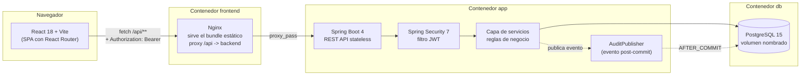
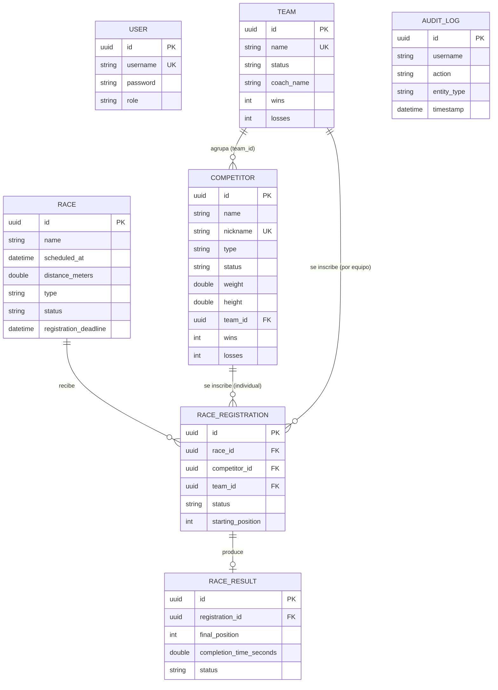

<div align="center">

# 🐫 The Great EIA Camel vs. Dwarf Racing System

**Sistema de gestión integral para la liga ficticia de carreras de camellos contra enanos de la Universidad EIA.**

API REST en Spring Boot + panel de administración en React, con autenticación por roles, persistencia en PostgreSQL y despliegue completo con Docker Compose y Kubernetes.


</div>

---

## Tabla de contenido

1. [Descripción del proyecto](#descripción-del-proyecto)
2. [Equipo](#equipo)
3. [Arquitectura](#arquitectura)
4. [Stack tecnológico](#stack-tecnológico)
5. [Modelo de datos](#modelo-de-datos)
6. [Seguridad](#seguridad)
7. [Roles y permisos](#roles-y-permisos)
8. [Puesta en marcha con Docker (recomendado)](#puesta-en-marcha-con-docker-recomendado)
9. [Puesta en marcha en modo desarrollo](#puesta-en-marcha-en-modo-desarrollo)
10. [Despliegue en Kubernetes](#despliegue-en-kubernetes)
11. [Variables de entorno](#variables-de-entorno)
12. [URLs y puertos](#urls-y-puertos)
13. [Pruebas automatizadas](#pruebas-automatizadas)
14. [Usuarios y datos de ejemplo](#usuarios-y-datos-de-ejemplo)
15. [Ejemplos de peticiones a la API](#ejemplos-de-peticiones-a-la-api)
16. [Limitaciones conocidas](#limitaciones-conocidas)
17. [Mejoras futuras](#mejoras-futuras)

---

## Descripción del proyecto

Mr. Abandonado, autoproclamado "Chief Executive Officer of Unnecessary Ideas", decidió revivir la legendaria competencia de carreras entre camellos y enanos de Universidad EIA. Este sistema reemplaza el histórico archivo `final_races_v2_FINAL_NOW_THIS_ONE.xlsx` (perdido para siempre) con una plataforma real: gestión de competidores y equipos, programación de carreras, inscripciones con validación de reglas de negocio, registro oficial de resultados y una tabla de clasificación general — todo protegido por autenticación JWT basada en roles y con trazabilidad completa mediante un log de auditoría.

## Equipo

| Integrante | Rol |
| :--- | :--- |
| Juan José Jaramillo | Desarrollo full-stack (backend, frontend, DevOps) |
| Dylan Mejía | Seguridad — validaciones de seguridad del sistema |
| Santiago Zuluaga | QA — pruebas funcionales de toda la aplicación |

## Arquitectura

El sistema está desacoplado en dos aplicaciones independientes que se comunican exclusivamente por HTTP/JSON: el cliente **nunca** accede a la base de datos directamente.



**Flujo de una petición:** el navegador llama a `/api/...` (mismo origen, sin CORS en producción) → Nginx reenvía la petición al backend → `JwtAuthenticationFilter` valida el token y carga el `Authentication` en el contexto de seguridad → el `@RestController` delega en el `@Service` correspondiente → el servicio aplica las reglas de negocio, persiste con Spring Data JPA y publica un evento de auditoría → el controlador serializa la respuesta a un DTO (nunca una entidad JPA) → si algo falla, `GlobalExceptionHandler` traduce la excepción a un JSON uniforme sin exponer stack traces.

### Estructura del repositorio

```text
camelracing/
├── compose.yml                  # Orquesta db + app + frontend
├── Dockerfile                   # Backend: build multi-stage (Gradle -> JRE)
├── .env.example                 # Plantilla de variables de entorno
├── build.gradle                 # Dependencias del backend
├── k8s/                         # Manifiestos de despliegue en Kubernetes
│   ├── 00-namespace.yaml
│   ├── 01-secret.yaml
│   ├── 02-configmap.yaml
│   ├── 03-postgres.yaml
│   ├── 04-backend.yaml
│   ├── 05-frontend.yaml
│   └── 06-ingress.yaml
├── src/main/java/com/eia/camelracing/
│   ├── competitor/ team/ race/ registration/ result/   # Un paquete por módulo de negocio
│   │   └── controller/ dto/ entity/ mapper/ repository/ service/
│   ├── security/                # JWT, filtros, roles, seed de usuarios
│   └── common/
│       ├── audit/               # Evento + listener de auditoría
│       ├── exception/           # Jerarquía de excepciones + manejador global
│       └── seed/                # Datos de ejemplo (competidores, equipos, carreras)
├── src/test/java/...            # 16 pruebas JUnit 5 / Mockito / MockMvc
└── frontend/
    ├── Dockerfile                # Frontend: build multi-stage (Node -> Nginx)
    ├── nginx.conf                # Proxy /api + fallback de SPA
    └── src/
        ├── api/                  # Cliente HTTP tipado por módulo
        ├── context/              # Auth y notificaciones (toasts)
        ├── components/           # Layout, badges, diálogos, estados vacíos/carga
        ├── pages/                # Una carpeta por módulo funcional
        └── styles/               # Design tokens ("Vibrant Racing")
```

## Stack tecnológico

| Capa | Tecnología |
| :--- | :--- |
| Backend | Java 21, Spring Boot 4.1, Spring Web, Spring Data JPA, Spring Security 7, Bean Validation |
| Autenticación | JWT (jjwt 0.12) firmado con HS512, contraseñas con BCrypt |
| Base de datos | PostgreSQL 15 (Docker, volumen nombrado) · H2 en memoria solo para tests |
| Frontend | React 18, TypeScript 5.6, Vite 5, React Router 7, Lucide Icons |
| Testing | JUnit 5, Mockito, Spring Boot Test (`MockMvc`), AssertJ |
| Contenedores | Docker, Docker Compose, Nginx (proxy inverso + servidor estático) |
| Orquestación | Kubernetes (Minikube), Ingress NGINX |

## Modelo de datos



Restricciones relevantes: `username` y `nickname`/`name` de equipo son únicos a nivel de base de datos (no solo validación en Java); `race_registrations.registration_id` es `UNIQUE` en `race_results` (una inscripción tiene a lo sumo un resultado); todas las claves foráneas son explícitas vía `@JoinColumn`.

## Seguridad

- **Autenticación stateless con JWT:** un único `SecurityFilterChain` sin sesiones de servidor; cada petición se autentica con el header `Authorization: Bearer <token>`.
- **Contraseñas:** hasheadas con `BCryptPasswordEncoder`, nunca se devuelven en ninguna respuesta de la API (los DTOs de salida no incluyen el campo `password`).
- **Autorización por rol:** anotaciones `@PreAuthorize` a nivel de método (`hasRole`, `hasAnyRole`), consistentes con lo que la interfaz oculta o deshabilita según el rol del usuario autenticado.
- **Errores uniformes:** `GlobalExceptionHandler` centraliza todas las respuestas de error en un JSON con `message`, `status` y `timestamp` — nunca se filtra un stack trace de Java o SQL al cliente.
- **Secretos fuera del código:** `JWT_SECRET`, credenciales de base de datos y puertos viven en `.env` (excluido por `.gitignore`); `.env.example` solo contiene placeholders y la instrucción para generar un secreto propio. El equivalente en Kubernetes (`k8s/01-secret.yaml`) sigue el mismo principio: solo contiene valores de ejemplo (`changeme`), nunca secretos reales — ver [Despliegue en Kubernetes](#despliegue-en-kubernetes).
- **CORS:** deshabilitado por defecto salvo para un origen explícito, configurable vía la propiedad `cors.allowed-origin` (por defecto `http://localhost:5173`, usado por `npm run dev`). En Docker, el frontend y la API comparten origen a través del proxy de Nginx, así que CORS ni siquiera entra en juego. En Kubernetes, como no hay un proxy de un único origen por defecto, este valor se fija explícitamente a la URL estable del Ingress (ver sección siguiente).
- **Auditoría transaccional:** cada acción sensible (login, alta de usuario, creación/edición de competidores, equipos, carreras, decisiones de inscripción, registro de resultados) dispara un evento que se persiste solo si la transacción que lo originó confirmó exitosamente (`@TransactionalEventListener(AFTER_COMMIT)`).

## Roles y permisos

| Rol | Puede |
| :--- | :--- |
| **Administrator** | Todo: gestionar competidores, equipos, usuarios y ver el log de auditoría completo, además de todo lo que puede el organizador. |
| **Race Organizer** | Crear y gestionar carreras, aprobar/rechazar inscripciones y registrar resultados. Solo lectura de competidores y equipos. |
| **Viewer** | Solo lectura: competidores, equipos, carreras, inscripciones, resultados y clasificación. |

## Puesta en marcha con Docker (recomendado)

Requisitos: Docker y Docker Compose.

```bash
git clone <url-del-repositorio>
cd camelracing
cp .env.example .env
# Edita .env y genera un JWT_SECRET propio:
#   openssl rand -base64 64
docker compose up --build -d
```

Al terminar tendrás 3 contenedores saludables (`docker compose ps`): `camelracing-db`, `camelracing-app` y `camelracing-frontend`. La primera vez que arranca contra una base de datos vacía, la aplicación siembra automáticamente los usuarios y el catálogo de ejemplo (ver [Usuarios y datos de ejemplo](#usuarios-y-datos-de-ejemplo)).

Abre `http://localhost:3000` e inicia sesión.

Para detener todo sin perder los datos: `docker compose down` (el volumen `camelracing_pgdata` persiste). Para resetear la base de datos desde cero: `docker compose down -v`.

## Puesta en marcha en modo desarrollo

### Backend

Requisitos: JDK 21, una instancia de PostgreSQL local (o usa `docker compose up -d db` para levantar solo la base de datos).

```bash
# Windows
gradlew.bat bootRun --args="--spring.profiles.active=dev"
# macOS/Linux
./gradlew bootRun --args="--spring.profiles.active=dev"
```

El perfil `dev` toma `DB_USERNAME`/`DB_PASSWORD`/`JWT_SECRET` de variables de entorno si existen, o usa valores genéricos de desarrollo (`postgres`/`postgres`) si no las defines.

### Frontend

Requisitos: Node.js 20+.

```bash
cd frontend
npm install
npm run dev
```

Vite sirve la SPA en `http://localhost:5173` y su propio proxy interno reenvía `/api/**` a `http://localhost:8080` (configurado en `vite.config.ts`), así que basta con tener el backend corriendo en el puerto por defecto.

## Despliegue en Kubernetes

Además de Docker Compose, el proyecto incluye manifiestos de Kubernetes (`k8s/`) para desplegarlo en un clúster local con **Minikube**, usado como laboratorio del curso de Kubernetes. Cada componente sigue exactamente el mismo diseño que su contenedor Docker equivalente: Postgres con volumen persistente, backend stateless con JWT, y frontend servido por Nginx — todo dentro del namespace `camelracing`.

### Requisitos

- Minikube y `kubectl` instalados y en el `PATH`.
- Las imágenes construidas localmente (Kubernetes no las descarga de ningún registry, son propias del proyecto):
  ```bash
  docker build -t camelracing-app:latest .
  docker build -t camelracing-frontend:latest ./frontend
  ```
- Cargar esas imágenes al nodo de Minikube:
  ```bash
  minikube image load camelracing-app:latest
  minikube image load camelracing-frontend:latest
  ```

### Estructura de los manifiestos

| Archivo | Contenido |
| :--- | :--- |
| `00-namespace.yaml` | Namespace `camelracing` |
| `01-secret.yaml` | Credenciales de BD y `JWT_SECRET` (placeholders — ver nota de seguridad más abajo) |
| `02-configmap.yaml` | Configuración no sensible (`DB_HOST`, `SERVER_PORT`, `CORS_ALLOWED_ORIGIN`, etc.) |
| `03-postgres.yaml` | PVC + Deployment + Service de PostgreSQL |
| `04-backend.yaml` | Deployment + Service (`app`) del backend Spring Boot |
| `05-frontend.yaml` | Deployment + Service NodePort del frontend |
| `06-ingress.yaml` | Ingress que unifica frontend y backend bajo un único host estable |

### Despliegue paso a paso

```bash
kubectl apply -f k8s/00-namespace.yaml
kubectl apply -f k8s/01-secret.yaml
kubectl apply -f k8s/02-configmap.yaml
kubectl apply -f k8s/03-postgres.yaml
kubectl apply -f k8s/04-backend.yaml
kubectl apply -f k8s/05-frontend.yaml

kubectl get pods -n camelracing -w   # espera a que los 3 queden en 1/1 Running
```

### Exponer la aplicación con Ingress (recomendado)

Un `Service` de tipo `NodePort` por sí solo funciona, pero expone frontend y backend bajo **orígenes distintos**, lo que obliga a habilitar CORS y a reconfigurarlo cada vez que cambia el puerto. La solución correcta — la misma idea que ya resuelve `nginx.conf` dentro del contenedor del frontend — es un **Ingress** que sirva todo bajo un único host estable:

```bash
minikube addons enable ingress
kubectl get pods -n ingress-nginx -w   # espera a que el controlador quede 1/1 Running
```

Como el driver Docker de Minikube en Windows no expone su IP interna directamente al host, la forma más simple de acceder sin tener que editar el archivo `hosts` del sistema es con **[nip.io](https://nip.io)**, un DNS público que resuelve cualquier nombre con una IP incrustada sin configuración adicional:

```bash
# En una terminal aparte, déjala corriendo (necesita privilegios de administrador):
minikube tunnel
```

Con el túnel activo, edita el `host` de `k8s/06-ingress.yaml` y el valor `CORS_ALLOWED_ORIGIN` de `k8s/02-configmap.yaml` para que ambos apunten a:

```
camelracing.127.0.0.1.nip.io
```

Luego:

```bash
kubectl apply -f k8s/02-configmap.yaml
kubectl apply -f k8s/06-ingress.yaml
kubectl rollout restart deployment/backend -n camelracing
```

Accede en el navegador a `http://camelracing.127.0.0.1.nip.io` — un origen único y estable, sin puertos que cambien entre sesiones.

> **Nota de seguridad:** `k8s/01-secret.yaml` solo contiene valores de ejemplo (`changeme`) — nunca reemplaces esos placeholders directamente en el archivo versionado. Para pruebas con un secreto real, créalo de forma imperativa sin que pase por ningún archivo:
> ```bash
> kubectl create secret generic camelracing-secret -n camelracing \
>   --from-literal=DB_NAME=camelracing_db \
>   --from-literal=DB_USERNAME=postgres \
>   --from-literal=DB_PASSWORD=tu-clave-real \
>   --from-literal=JWT_SECRET=tu-secreto-real
> ```

### Limpiar el despliegue

```bash
kubectl delete namespace camelracing
```
Esto elimina todos los recursos del namespace, incluido el volumen persistente de Postgres.

## Variables de entorno

| Variable | Descripción | Dónde se usa |
| :--- | :--- | :--- |
| `DB_HOST` / `DB_PORT` / `DB_NAME` | Conexión a PostgreSQL | Backend (perfil `docker`) |
| `DB_USERNAME` / `DB_PASSWORD` | Credenciales de la base de datos | Backend, contenedor `db` |
| `JWT_SECRET` | Clave HMAC para firmar los JWT (genera la tuya con `openssl rand -base64 64`) | Backend |
| `JWT_EXPIRATION` | Vigencia del token en milisegundos | Backend |
| `SERVER_PORT` | Puerto expuesto por el backend | Backend, `compose.yml` |
| `FRONTEND_PORT` | Puerto expuesto por el frontend (Nginx) | `compose.yml` |
| `API_BASE_URL` | URL base que usaría el frontend si no compartiera origen con la API | Documentación / despliegues alternativos |
| `CORS_ALLOWED_ORIGIN` | Origen exacto permitido por CORS (solo relevante cuando frontend y API NO comparten origen, como en Kubernetes sin Ingress) | Backend |

`.env.example` documenta todos estos valores con placeholders seguros. **Nunca** commitees el archivo `.env` real.

## URLs y puertos

| Componente | URL local (Docker) | URL local (dev) | URL local (Kubernetes) |
| :--- | :--- | :--- | :--- |
| Frontend (SPA) | http://localhost:3000 | http://localhost:5173 | http://camelracing.127.0.0.1.nip.io |
| Backend (API REST) | http://localhost:8080/api | http://localhost:8080/api | http://camelracing.127.0.0.1.nip.io/api |
| PostgreSQL | localhost:5432 | localhost:5432 | *(interno al clúster, Service `postgres`)* |

## Pruebas automatizadas

16 pruebas automatizadas (unitarias con Mockito + de integración con `MockMvc` sobre H2 en memoria, perfil `test`), agrupadas en 9 clases que cubren los 15 escenarios obligatorios: creación válida y rechazo de datos inválidos para competidores y carreras, inscripciones (activo/suspendido/duplicado/fuera de plazo), resultados (válido y ganador duplicado), y seguridad (401 sin token, 403 para `VIEWER`, 201 para `ADMIN`, 404 para recursos inexistentes).

```bash
# Windows
gradlew.bat test
# macOS/Linux
./gradlew test
```

El reporte HTML queda en `build/reports/tests/test/index.html`.

## Usuarios y datos de ejemplo

Sembrados automáticamente la primera vez que la aplicación arranca contra una base de datos vacía:

| Usuario | Contraseña | Rol |
| :--- | :--- | :--- |
| `admin` | `Admin123!` | Administrator |
| `organizador` | `Organizer123!` | Race Organizer |
| `viewer` | `Viewer123!` | Viewer |

Catálogo de ejemplo: 5 enanos (`Null Pointer`, `Stack Overflow`, `Little Lambda`, `Captain Cache`, `Tiny Docker`), 2 camellos (`Byte`, `Kernel`) y 2 competidores medianos (`Garbage Collector`, `Bitwise Operator`); los equipos `The Five Exceptions` (los 5 enanos) y `The Desert Threads` (camello + medianos); y 3 carreras — una **finalizada** con podio oficial (`Gran Premio de Zúñiga 1979`), una **en curso** lista para cargar resultados (`Clásico Alto de Las Palmas`) y una **abierta a inscripciones** (`Derby Tecnológico EIA`).

## Ejemplos de peticiones a la API

```bash
# Login
curl -X POST http://localhost:8080/api/auth/login \
  -H "Content-Type: application/json" \
  -d '{"username":"admin","password":"Admin123!"}'

# Listar competidores activos (paginado)
curl "http://localhost:8080/api/competitors?status=ACTIVE&page=0&size=10" \
  -H "Authorization: Bearer <token>"

# Crear una carrera (requiere rol ADMIN u ORGANIZER)
curl -X POST http://localhost:8080/api/races \
  -H "Authorization: Bearer <token>" \
  -H "Content-Type: application/json" \
  -d '{
        "name": "Gran Desafío EIA",
        "scheduledAt": "2027-01-15T09:00:00",
        "distanceMeters": 1000,
        "maxParticipants": 8,
        "type": "MIXED",
        "registrationDeadline": "2027-01-10T23:59:59"
      }'

# Clasificación general de competidores
curl http://localhost:8080/api/standings/competitors -H "Authorization: Bearer <token>"
```

Todas las respuestas de error siguen el mismo formato:

```json
{
  "message": "Competidor 3b1e...-no encontrado",
  "status": 404,
  "timestamp": "2026-09-12T04:30:00"
}
```

## Limitaciones conocidas

- No hay refresh tokens: el JWT expira a la hora (`JWT_EXPIRATION`) y el usuario debe volver a iniciar sesión.
- El registro público (`POST /api/auth/register`) siempre crea usuarios con rol `VIEWER`; asignar roles `ADMIN`/`ORGANIZER` es una operación manual sobre la base de datos.
- Las clasificaciones (`/api/standings/**`) se recalculan en cada consulta a partir de los resultados almacenados; no hay una tabla materializada ni caché.
- No se implementaron notificaciones en tiempo real (WebSockets) para actualizaciones en vivo de una carrera en curso.
- La auditoría registra la acción y su descripción, pero `previousValue`/`newValue` solo se completan en los cambios de estado (competidores y carreras), no en todas las ediciones de campos.
- El host del Ingress de Kubernetes (`camelracing.127.0.0.1.nip.io`) depende de que `minikube tunnel` esté corriendo; si se cierra esa terminal o se reinicia el clúster, hay que volver a levantarlo. En un clúster real (no Minikube local), un Ingress con un dominio propio no tendría esta limitación.

## Mejoras futuras

- Refresh tokens y expiración deslizante de sesión.
- Actualizaciones en vivo de resultados vía WebSockets para la pantalla de Standings.
- Exportación de clasificaciones y resultados a CSV/PDF.
- Pipeline de CI/CD (GitHub Actions) con build, tests y publicación de imágenes Docker.
- Testcontainers para pruebas de integración contra PostgreSQL real en vez de H2.
- Panel de administración de usuarios y roles desde la propia interfaz.
- Helm chart para simplificar el despliegue en Kubernetes (parametrizar namespace, imágenes y host del Ingress en vez de editarlos manualmente).